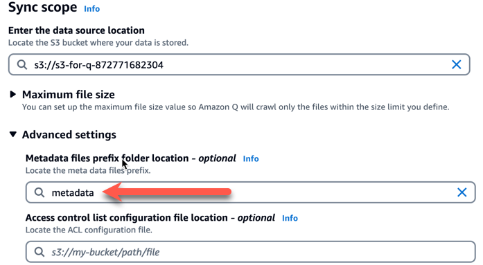

# Enable Amazon Q for Busines for S3

This solution creates the infrastructure to allow Amazon Q for Business to open S3 objects when selected.
The solution leverages an [s3 metadata file](https://docs.aws.amazon.com/amazonq/latest/qbusiness-ug/s3-metadata.html)
to update the S3 object url to reference a CloudFront distribution

- S3 bucket
- CloudFront distribution (uses S3 bucket as origin)
- Lambda function (triggered from Create events on S3 bucket to generate Amazon Q metadata)

## 🚀 Deploy

```bash
./deploy.sh <bucket_name> <stack_name>
```

## Getting Started

1. Deploy this solution
2. Setup Amazon Q for Business chat application with a data source pointing to the S3 bucket created by the deployment
   1. When adding the data source make sure to define the metadata path as `metadata` (example below)
   2. 

## Development

Create virtual environment and install requirements

```bash
python3 -m venv .venv
source .venv/bin/activate
pip install -r requirements.txt
```
