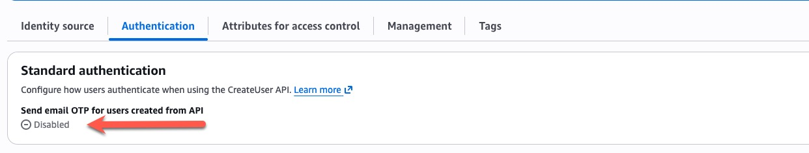

# Bulk IDC User Creation

Bulk-create IAM Identity Center (IDC) users from a CSV manifest and add each
user to one or more existing groups. Uses the AWS Identity Store API directly.

## Purpose

Automate the creation of many Identity Center users from a single CSV file.
Each user is created in the Identity Store, then added to the group(s) listed
in the manifest. Re-runs are idempotent, so the tool integrates cleanly with
CI pipelines. The script exits non-zero if any row failed.

## Prerequisites

- Run against the account/region where the **IAM Identity Center instance**
  lives (the management account, or a delegated administrator account).
- [`uv`](https://docs.astral.sh/uv/) installed.
- Target groups must **already exist** — this tool does not create groups. A
  row referencing an unknown group is reported as `FAILED`.

## Required IAM Permissions

```json
{
  "Effect": "Allow",
  "Action": [
    "sso:ListInstances",
    "identitystore:ListUsers",
    "identitystore:ListGroups",
    "identitystore:CreateUser",
    "identitystore:CreateGroupMembership",
    "identitystore:ListGroupMembershipsForMember",
    "sts:GetCallerIdentity"
  ],
  "Resource": "*"
}
```

## Manifest Format

The manifest is a CSV file with the following columns:

| Column         | Required | Description                                              |
|----------------|----------|----------------------------------------------------------|
| `first_name`   | Yes      | User's given name                                        |
| `last_name`    | Yes      | User's family name                                       |
| `display_name` | No       | Display name; falls back to `first_name last_name`       |
| `username`     | Yes      | Unique Identity Store username                           |
| `email`        | Yes      | Primary (work) email address                             |
| `memberOf`     | No       | Group(s) to add the user to, separated by `;`            |

The `memberOf` cell may name multiple groups separated by a semicolon, e.g.
`Admins;Developers`. Leave it blank to create a user with no group memberships.

See [`users.csv.sample`](users.csv.sample) for an example:

```csv
first_name,last_name,display_name,username,email,memberOf
Ada,Lovelace,Ada Lovelace,alovelace,ada@example.com,Admins;Developers
Grace,Hopper,,ghopper,grace@example.com,Developers
Alan,Turing,Alan Turing,aturing,alan@example.com,
```

## Usage

### Run without cloning (uvx)

Run the tool directly from the repository with [`uvx`](https://docs.astral.sh/uv/guides/tools/)
— no clone or install required:

```bash
uvx --from "git+https://github.com/dmorand17/aws-samples.git#subdirectory=management/bulk-idc-user-creation" \
  create-idc-users --manifest users.csv --dry-run
```

The `--manifest` file is read from your current working directory, so keep your
CSV local. Pin to a tag or commit by appending `@<ref>` before the `#`, e.g.
`...aws-samples.git@v0.1.0#subdirectory=...`.

### Install as a tool

Install once with [`uv tool`](https://docs.astral.sh/uv/guides/tools/) to get a
`create-idc-users` command on your `PATH`, then run it without the long URL:

```bash
uv tool install "git+https://github.com/dmorand17/aws-samples.git#subdirectory=management/bulk-idc-user-creation"

create-idc-users --manifest users.csv --dry-run
```

Upgrade with `uv tool upgrade bulk-idc-user-creation`; remove with
`uv tool uninstall bulk-idc-user-creation`.

### Run from a clone

```bash
# Dry run — validate manifest and groups, create nothing
uv run create-idc-users --manifest users.csv --dry-run

# Create users, print results as JSON to stdout (pipe or redirect as needed)
uv run create-idc-users --manifest users.csv --output-format json > results.json

# Or write results directly to a file
uv run create-idc-users --manifest users.csv \
  --output-format json --output-file results.json

# Target a specific Identity Store when more than one instance exists
uv run create-idc-users --manifest users.csv \
  --identity-store-id d-1234567890 --output-format csv
```

Results in any format go to stdout by default; the progress bar is written to
stderr, so redirecting stdout to a file yields clean `csv`/`json`. Use
`--output-file` to write to a file instead.

### Options

| Option                | Default          | Description                                          |
|-----------------------|------------------|------------------------------------------------------|
| `--manifest`          | required         | Path to the CSV manifest                             |
| `--identity-store-id` | auto-discovered  | Identity Store ID; required only if you have >1 instance |
| `--output-format`     | `stdout`         | Result format: `stdout`, `csv`, or `json`            |
| `--output-file`       | —                | Write results to this file instead of stdout         |
| `--dry-run`           | off              | Validate manifest and groups without creating anything |

## Result Statuses

| Status    | Meaning                                                            |
|-----------|-------------------------------------------------------------------|
| `CREATED` | New user created and added to the listed groups                   |
| `UPDATED` | User already existed; added to one or more missing groups         |
| `SKIPPED` | User already existed and was already in every listed group        |
| `FAILED`  | A listed group does not exist, or the API rejected the request    |

## Passwords

Users created through the Identity Store API (as this tool does, exactly like
`aws identitystore create-user`) are created **without a password**, and the
API does **not** send an email. The console's "Send an email with password
setup instructions" option is a console-only feature with no API equivalent —
there is no per-user parameter to email a temporary password.

To have these users receive an email to set their own password, enable the
account-level **email OTP** setting once:

**IAM Identity Center → Settings → Authentication → Standard authentication →
Configure → select "Send email OTP" → Save.**



With that setting enabled, each user created by this tool receives a
verification email on their **first sign-in attempt** and then sets their own
password. This tool always writes the CSV `email` as the user's primary (work)
email, which is the prerequisite for that flow. If you leave the setting
disabled, you must generate and share a one-time password manually from the
console — that path has no API and cannot be automated here. See
[Email one-time password to users created with API or CLI](https://docs.aws.amazon.com/singlesignon/latest/userguide/userswithoutpwd.html).

## Caveats

- **Idempotent re-runs.** Before provisioning, the tool lists existing users
  and groups. A row whose username already exists is never re-created; the tool
  only reconciles group membership (adding the user to any listed group they
  are not yet in). Username matching is case-insensitive. Existing users are
  **not** otherwise reconciled — display name, email, and name attributes are
  left untouched.
- **Groups must pre-exist.** Groups named in `memberOf` are not created. A row
  referencing an unknown group is reported as `FAILED` and its user is not
  created; other rows still proceed.
- **One instance assumed.** When multiple Identity Center instances are found,
  the tool stops and asks you to pass `--identity-store-id`.

## Development

Dev tooling (`pytest`, `ruff`) is declared in the `dev` dependency group and
installed automatically on first `uv run`.

```bash
# Run the test suite
uv run pytest

# Lint
uv run ruff check
```
