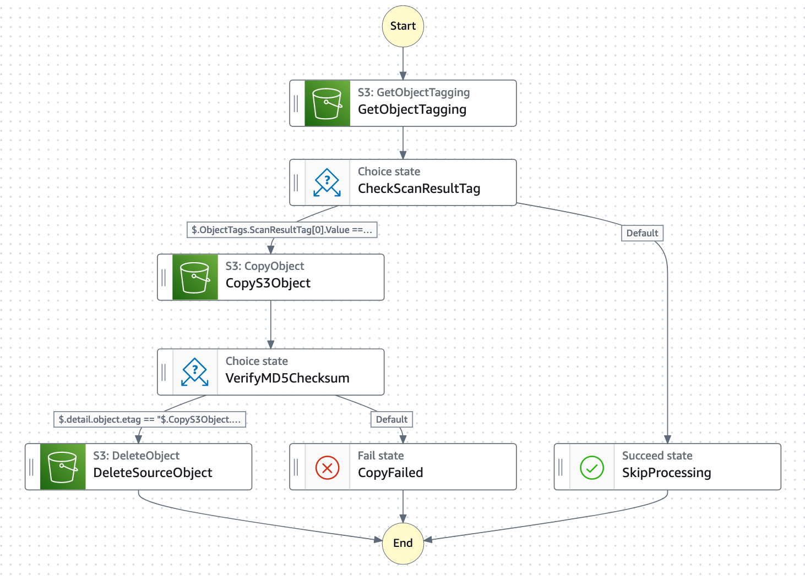

# 🚀 S3 Event-Driven Step Functions Workflow

This project sets up an AWS infrastructure for automatically processing S3 objects based on specific tags.

## 📋 Table of Contents

- [🚀 S3 Event-Driven Step Functions Workflow](#-s3-event-driven-step-functions-workflow)
  - [📋 Table of Contents](#-table-of-contents)
  - [🔎 Overview](#-overview)
  - [🏗️ Architecture](#️-architecture)
  - [📝 Prerequisites](#-prerequisites)
  - [🚀 Deployment](#-deployment)
  - [🧪 Testing](#-testing)
  - [🧹 Cleanup](#-cleanup)
  - [🤝 Contributing](#-contributing)
  - [📄 License](#-license)

## 🔎 Overview

This CloudFormation template deploys a serverless workflow that:

1. Monitors a source S3 bucket for new objects with a specific tag
2. Copies tagged objects to a destination bucket
3. Verifies the integrity of the copied object
4. Deletes the original object if the copy was successful

## 🏗️ Architecture

The solution uses the following AWS services:

- 🪣 Amazon S3 (Source and Destination buckets)
- 🔄 AWS Step Functions
- ⚡ Amazon EventBridge
- 🔐 AWS IAM



## 📝 Prerequisites

- An AWS account
- AWS CLI installed and configured
- Basic knowledge of AWS services and CloudFormation

## 🚀 Deployment

1. Clone this repository:

   ```bash
   git clone https://github.com/yourusername/s3-stepfunctions-workflow.git
   cd s3-stepfunctions-workflow
   ```

2. Deploy the CloudFormation stack:

   ```bash
   aws cloudformation package \
      --s3-bucket <bucket>
      --template-file assets/cloudformation/main.tml \
      --output-template=file main-generated.yml

   aws cloudformation deploy --stack-name clean-file-transfer-stack \
    --template-file assets/cloudformation/main.yml \
    --capabilities CAPABILITY_IAM
   ```

3. Wait for the stack creation to complete:
   ```bash
   aws cloudformation wait stack-create-complete --stack-name clean-file-transfer-stack
   ```

## 🧪 Testing

1. Update DynamoDB table to add `lab` mapping
   1. add attribute: `string`
   2. name: `s3BucketName`
   3. value: `s3 bucket`
2. Upload a file to the source S3 bucket with the tag `ScanResult=CLEAN`:

   ```bash
   aws s3api put-object --bucket SOURCE_BUCKET_NAME \
    --key test-file.txt \
    --body ./test-file.txt
   ```

   Update tags

   ```bash
   aws s3api put-object-tagging --bucket SOURCE_BUCKET_NAME \
   --key your-object-key \
   --tagging 'TagSet=[{Key=ScanResult,Value=CLEAN}]'
   ```

3. Check the destination bucket to verify that the file was copied:

   ```bash
   aws s3 ls s3://DESTINATION_BUCKET_NAME
   ```

4. Verify that the original file was deleted from the source bucket:
   ```bash
   aws s3 ls s3://SOURCE_BUCKET_NAME
   ```

## 🧹 Cleanup

To remove all resources created by this stack:

```bash
aws cloudformation delete-stack --stack-name S3StepFunctionsWorkflow
```

## 🤝 Contributing

Contributions are welcome! Please feel free to submit a Pull Request.

## 📄 License

This project is licensed under the MIT License - see the [LICENSE](LICENSE) file for details.
